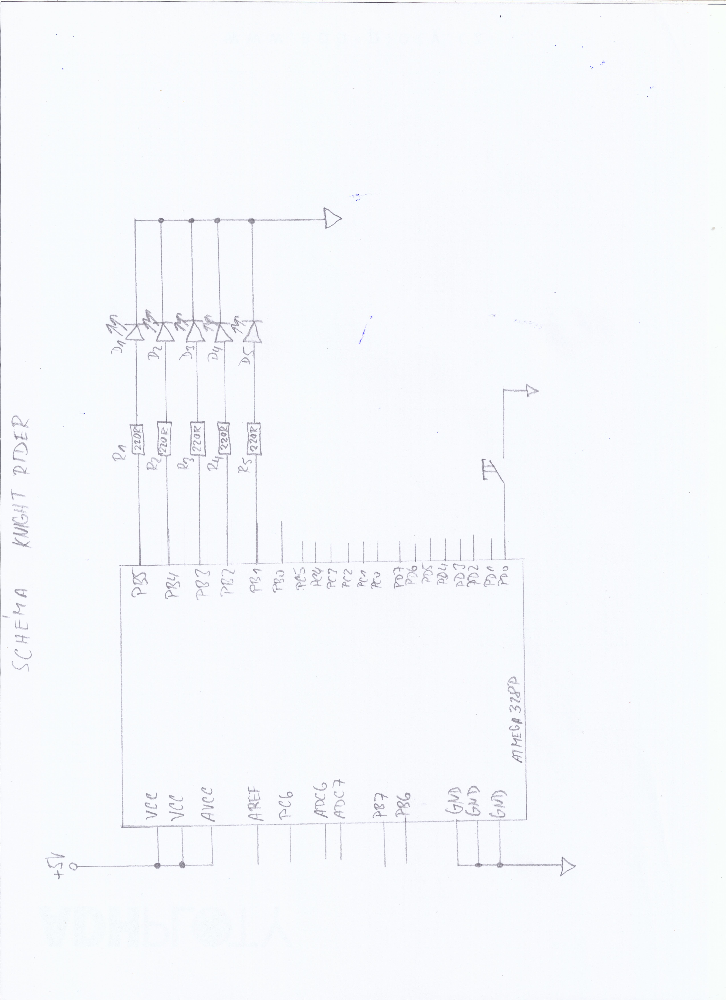

# Lab 2: LADISLAV DRÁPAL

Link to your `Digital-electronics-2` GitHub repository:

   [https://github.com/Ladislav-Drapal/Digital-electronics-2/tree/main/Labs/](https://github.com/Ladislav-Drapal/Digital-electronics-2/tree/main/Labs/)


### Active-low and active-high LEDs

1. Complete tables according to the AVR manual.

| **DDRB** | **Description** |
| :-: | :-- |
| 0 | Input pin |
| 1 | Output pin |

| **PORTB** | **Description** |
| :-: | :-- |
| 0 | Output low value |
| 1 | Output high value |

| **DDRB** | **PORTB** | **Direction** | **Internal pull-up resistor** | **Description** |
| :-: | :-: | :-: | :-: | :-- |
| 0 | 0 | input | no | Tri-state, high-impedance |
| 0 | 1 | input | no, yes | Tri-state (Hi-Z), Pxn will source current |
| 1 | 0 | output | no | Output low (sink) |
| 1 | 1 | output | no | Output high (source) |

| **Port** | **Pin** | **Input/output usage?** |
| :-: | :-: | :-- |
| A | x | Microcontroller ATmega328P does not contain port A |
| B | 0 | Yes (Arduino pin 8) |
| B | 1 | Yes (Arduino pin 9) |
| B | 2 | Yes (Arduino pin 10) |
| B | 3 | Yes (Arduino pin 11) |
| B | 4 | Yes (Arduino pin 12) |
| B | 5 | Yes (Arduino pin 13) |
| B | 6 | No |
| B | 7 | No |
| C | 0 | Yes (Arduino pin A0) |
| C | 1 | Yes (Arduino pin A1) |
| C | 2 | Yes (Arduino pin A2) |
| C | 3 | Yes (Arduino pin A3) |
| C | 4 | Yes (Arduino pin A4) |
| C | 5 | Yes (Arduino pin A5) |
| C | 6 | No |
| C | 7 | No |
| D | 0 | Yes (Arduino pin RX<-0) |
| D | 1 | Yes (Arduino pin TX->1) |
| D | 2 | Yes (Arduino pin 2) |
| D | 3 | Yes (Arduino pin 3) |
| D | 4 | Yes (Arduino pin 4) |
| D | 5 | Yes (Arduino pin 5) |
| D | 6 | Yes (Arduino pin 6) |
| D | 7 | Yes (Arduino pin 7) |


2. Part of the C code listing with syntax highlighting, which blinks alternately with a pair of LEDs; let one LED is connected to port B and the other to port C:

```c
int main(void)
{
    // Green LED at port B
    // Set pin as output in Data Direction Register...
    DDRB = DDRB | (1<<LED_GREEN);
    // ...and turn LED off in Data Register
    PORTB = PORTB & ~(1<<LED_GREEN);

    // Configure the second LED at port C
	DDRC = DDRC | (1<<LED_RED); //vystup
	
	PORTC = PORTC & (0<<LED_RED); //log1, led nesviti


    // Configure Push button at port D and enable internal pull-up resistor
	
	DDRD = DDRD & ~(1 <<BUTTON);
	PORTD = PORTD | (1 <<BUTTON);


    // Infinite loop
    while (1)
    {
        // WRITE YOUR CODE HERE
		PORTB = PORTB | (1<<LED_GREEN);
		_delay_ms(BLINK_DELAY);
		PORTB = PORTB & ~(0<<LED_GREEN);
		_delay_ms(BLINK_DELAY);
		
		PORTC = PORTC & ~(0<<LED_RED);
		_delay_ms(BLINK_DELAY);
		PORTC = PORTC | (1<<LED_RED);
		_delay_ms(BLINK_DELAY);
    }

    // Will never reach this
    return 0;
}
```


### Push button

1. Part of the C code listing with syntax highlighting, which toggles LEDs only if push button is pressed. Otherwise, the value of the LEDs does not change. Let the push button is connected to port D:

```c
    // Configure Push button at port D and enable internal pull-up resistor
    // WRITE YOUR CODE HERE

    // Infinite loop
    while (1)
    {
		PORTB = PORTB ^ (1<<LED_GREEN);
		_delay_ms(BLINK_DELAY);
		PORTC = PORTC ^ (1<<LED_RED);
		_delay_ms(BLINK_DELAY);
		
		if(bit_is_clear(PIND, BUTTON))
		{
			
		    PORTB = PORTB ^ (1<<LED_GREEN);
			PORTC = PORTC ^ (1<<LED_RED);
			//loop_until_bit_is_clear(PIND, BUTTON); 
		
		}
    }
```


### Knight Rider

1. Scheme of Knight Rider application, i.e. connection of AVR device, five LEDs, resistors, one push button, and supply voltage. The image can be drawn on a computer or by hand. Always name all components and their values!

   