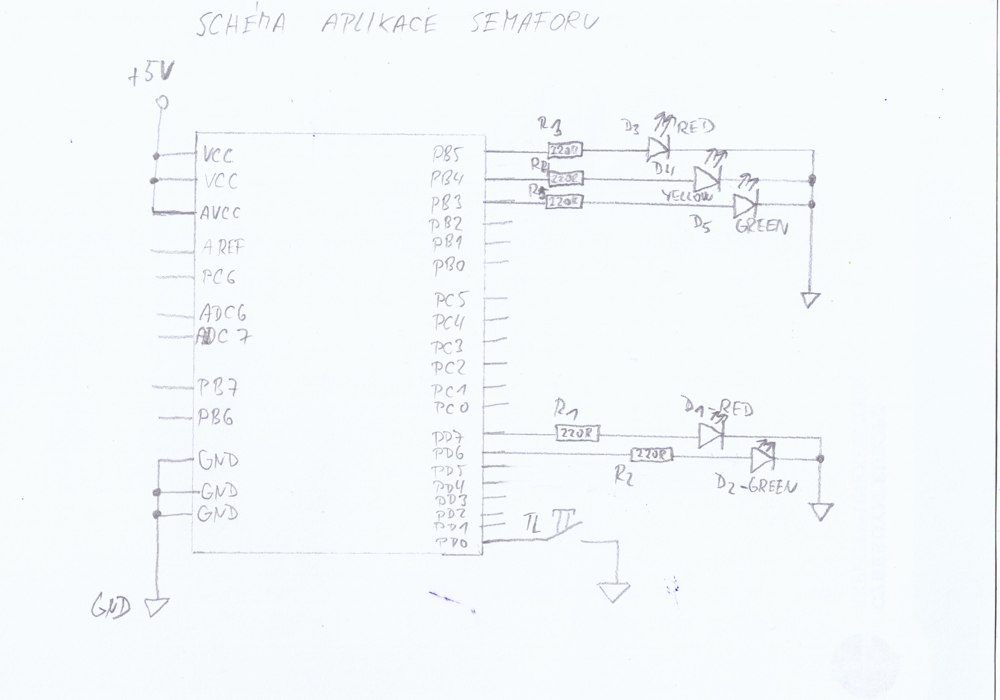

# Lab 3: YOUR_FIRSTNAME FAMILYNAME

Link to your `Digital-electronics-2` GitHub repository:

   [https://github.com/Ladislav-Drapal/Digital-electronics-2/](https://github.com/Ladislav-Drapal/Digital-electronics-2/)


### Data types in C

1. Complete table.

| **Data type** | **Number of bits** | **Range** | **Description** |
| :-: | :-: | :-: | :-- | 
| `uint8_t`  | 8 | 0, 1, ..., 255 | Unsigned 8-bit integer |
| `int8_t`   | 8 | -128 .. 127 | signed 8-bit integer |
| `uint16_t` | 16 | 0 .. 65,535 | Unsigned 16-bit integer |
| `int16_t`  | 16 | -32,768 .. 32,767 | fastest signed 16-bit integer |
| `float`    | 32 | -3.4e+38, ..., 3.4e+38 | Single-precision floating-point |
| `void`     | 0 | 0 | no parametres |


### GPIO library

1. In your words, describe the difference between the declaration and the definition of the function in C.
   * Function declaration – ukazuje jak funkce vypadá, co nám vrací a jaké má parametry.
   * Function definition – říká nám, kde se proměnná ukládá. Paměť pro proměnnou je přidělena během definice.

2. Part of the C code listing with syntax highlighting, which toggles LEDs only if push button is pressed. Otherwise, the value of the LEDs does not change. Use function from your GPIO library. Let the push button is connected to port D:

```c
int main(void)
{
    // Green LED at port B
    GPIO_config_output(&DDRB, LED_GREEN);
    GPIO_write_low(&PORTB, LED_GREEN);

    // Configure the second LED at port C
	
	GPIO_config_output(&DDRC, LED_RED);
	GPIO_write_low(&PORTC, LED_RED);
  

    // Configure Push button at port D and enable internal pull-up resistor
	GPIO_config_output(&DDRD, BUTTON);
	GPIO_write_low(&PORTD, BUTTON);


    // Infinite loop
    while (1)
    {
	    uint8_t PIN_BUTTON = GPIO_read(&PIND, BUTTON);
	    
	    if(PIN_BUTTON == 0)
	    {
		    GPIO_toggle(&PORTB, LED_GREEN);
		    // Pause several milliseconds
		    _delay_ms(BLINK_DELAY);
			
		    GPIO_toggle(&PORTC, LED_RED);
			// Pause several milliseconds
			_delay_ms(BLINK_DELAY);
	    }
    }
    return 0;
}

```


### Traffic light

1. Scheme of traffic light application with one red/yellow/green light for cars and one red/green light for pedestrians. Connect AVR device, LEDs, resistors, one push button (for pedestrians), and supply voltage. The image can be drawn on a computer or by hand. Always name all components and their values!

   